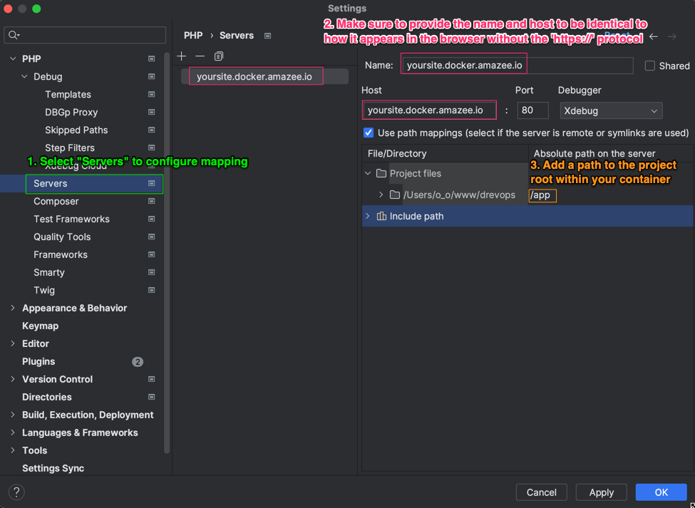

# Xdebug - Debugger Tool for PHP

https://xdebug.org/

> Xdebug is an extension for PHP, and provides a range of features to improve
> the PHP development experience.

DrevOps comes with Xdebug pre-installed and configured for local development
thanks to [Lagoon images](https://github.com/uselagoon/lagoon-images).

Xdebug is also configured to work in coverage mode, allowing to run tests with
code coverage enabled. See [PHPUnit](../phpunit#Coverage) for more details.

## Usage

Xdebug is disabled by default.

```shell
XDEBUG_ENABLE=true docker compose up -d cli php nginx   # Restart containers with Xdebug enabled.
docker compose up -d cli php nginx                      # Restart containers with Xdebug disabled.
```

or

```shell
ahoy debug-on  # Restart containers with Xdebug enabled.
ahoy up        # Restart containers with Xdebug disabled.
```

## IDE configuration

### PhpStorm

By default, PhpStorm is configured to automatically interrupt on incoming
unmapped debug connections when `Start listening for PHP Debug Connections`
button (the one with a little bug) is activated. When interrupted, PhpStorm
will ask you to map the incoming connection to a project.

In order to use Xdebug on the project for the first time, you need to follow
these steps (assuming you already have a fully working site):

1. Install Xdebug helper extension for your browser:
     - [Chrome Xdebug Helper](https://chrome.google.com/webstore/detail/xdebug-helper/eadndfjplgieldjbigjakmdgkmoaaaoc)
       extension.
     - [Firefox Xdebug Helper](https://addons.mozilla.org/en-US/firefox/addon/xdebug-helper-for-firefox/)
       extension.
     - [Edge Xdebug Helper](https://microsoftedge.microsoft.com/addons/detail/xdebug-helper/ggnngifabofaddiejjeagbaebkejomen)
       add-on.

2. Enable Xdebug in your browser (see instructions for your extension/add-on).
3. Set a breakpoint in your IDE. `index.php` in your web root is a good place to
   start.
4. Run `ahoy debug` or `XDEBUG_ENABLE=true docker compose up -d cli php nginx`
   to enable Xdebug.
5. Refresh the page in your browser.
6. PhpStorm will stop on your breakpoint and will ask you to map the incoming
   connection to directory in your project. This is because the code runs in the
   Docker container, which qualifies as a remote server. You need to "tell"
   Xdebug where to find the code on your local machine that corresponds to the
   code running in the container. You would need to do it once and PhpStorm will
   remember the mapping.



For more information see the following resources:
- https://www.jetbrains.com/help/phpstorm/configuring-xdebug.html#debugging-with-phpstorm
- https://docs.lagoon.sh/using-lagoon-advanced/setting-up-xdebug-with-lagoon/

### Tips and tricks

Once your first Xdebug session is set up, you can adjust some of the Debug
configurations in the PhpStorm IDE to make your life easier:

- Disable the following options:
     - `Break at first line in PHP scripts`
     - `Force break at first line when no path mapping specified`
     - `Force break at first line when a script is outside the project`
- Increase the number in `Max. simultaneous connections` to `5` or more. This
  will prevent hidden debug session being "stuck" without being visible in
  the IDE.

Running PHP from the command line with Xdebug works the same way as
debugging a web page, except that you need to run it from within the
Docker container.
